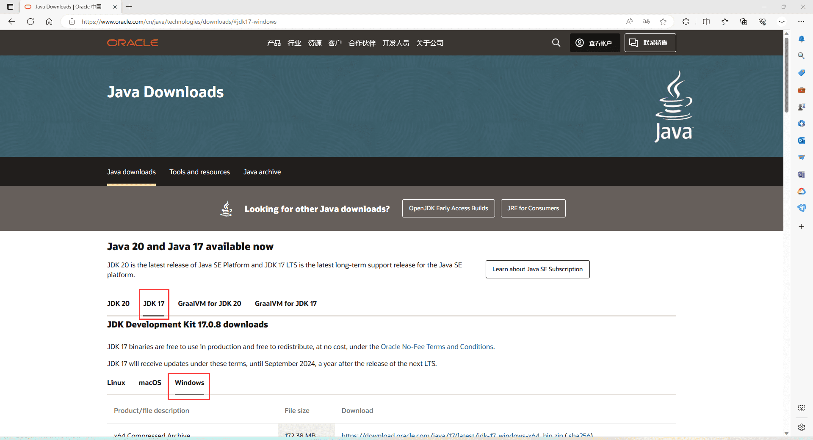
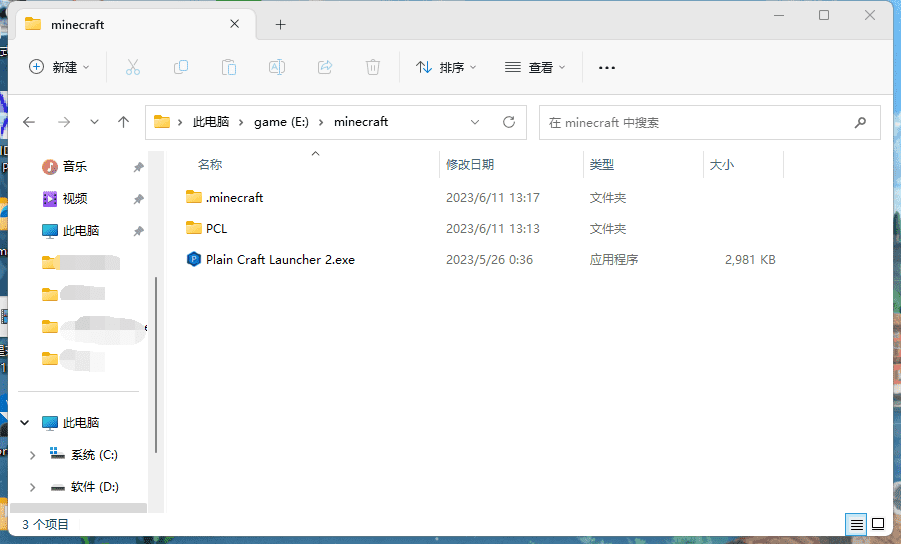

## 安装Java
Minecraft1.18开始要求使用Java17，所以第一步就是安装Java17  
首先打开[甲骨文Java下载页](https://www.oracle.com/cn/java/technologies/downloads/)  
选择JDK17并选择Windows  

有三个安装方式：两种安装包和一个压缩包  
一般没有其他需求选择选择.msi或者.exe的安装包即可，都是全部点击下一步就安装完成了 
## 启动器
Minecraft的游玩需要启动器来启动Minecraft  
Minecraft官方有启动器但是对国内玩家并不友好且需要正版账号，所以这里推荐使用第三方启动器  
Windows下推荐[PCL](https://afdian.net/a/LTCat)和[HMCL](https://hmcl.huangyuhui.net)这两个启动器  
下载后不要着急启动，建议将启动器单独放到一个文件夹，就像这样
 
以免文件散乱
## 启动游戏  
选择好你想要的登陆方式，并下载游戏  
Craft233服务器版本允许1.19.X和1.20.X的版本加入，建议下载最新的正式版游戏  
