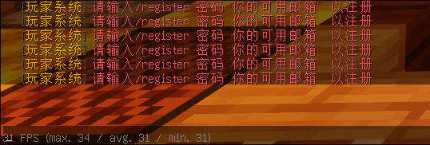

## 为什么有登陆？
由于是离线互通服务器，没有启用正版验证，玩家身份并不能像正版服务器一样通完全可以过uuid区分每一个人。离线账户的无限制导致如果没有登陆插件，就仅仅需要改变玩家名称就可以登陆他人账户盗号。为了防止此类事件，出现了登陆插件防止盗号。
## 如何注册？
在你进入服务器时会提示注册/登陆。如果你是第一次进入服务器，就需要进行注册

此时你只需要输入<code>/reg 你要设置的密码 你要设置的邮箱</code>
::: info 举个例子
/reg Password zhangsan@testmail.com
:::
其中<code>Password</code>就是你要设置的登陆密码，而<code>zhangsan@testmail.com</code>就是你要设置的邮箱  
邮箱可以在你忘记密码或更改密码的时候进行验证。
### 无法注册？
#### IP无法再注册
如果你在注册时遇到下图情况

这种情况一般是你所在的地理区域或你使用的代理所使用的ipv4地址已有人注册。  
如果你没有启用代理及加速器，这可能是由于附近同运营商已有用户注册，你可以尝试光猫重新拨号或者重启来分配到另一个公网出口ip地址  
如果你在反复尝试后无果，可寻求服务器管理员帮忙注册
这是ipv4地址枯竭的结果，运营商不得不使用[NAT](https://baike.baidu.com/item/NAT/320024)或者[NAPT](https://baike.baidu.com/item/NAPT/61086968)技术。
#### 已经被注册？
如果你是第一次来到服务器，但是仍然提示登陆而非注册，说明你使用的这个用户名已经有人使用  
这种情况只能另外改名。Java离线登陆可以直接改名


基岩版如果近期没有改名需求或已经改过一次名，建议重新注册一个微软账号使用。

#### 邮箱不可用？
[这里](../common_question/)是所有支持的邮箱以及情况说明

## 登陆
在完成注册后，当你下一次进入服务器，则会提示登陆而非注册

这个时候只需要输入<code>/l 你设置的密码</code>  
比如之前设置的密码是<code>Password</code>，那么就需要输入
```
/l Password
```
回车，即可登陆服务器
