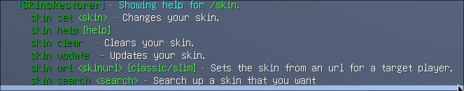
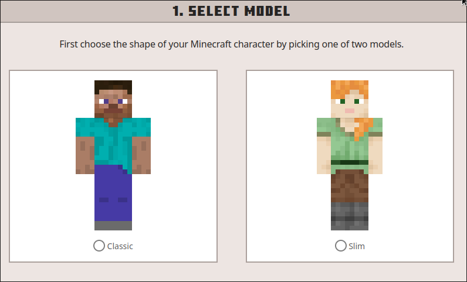

## 介绍
skin指令是啥？这里引用一下spigot插件的介绍  
::: info
SkinsRestorer is a plugin that restores skins for offline mode servers & networks that gives the players ability to change their skins by typing a single command.
:::
SkinsRestorer为离线服务器提供了显示皮肤的功能，用指令也能轻松更换皮肤。
## 语法
SkinsRestorer提供了一些子命令来控制自己的玩家皮肤  

其中包括<code>set</code>,<code>help</code>,<code>clear</code>,<code>update</code>,<code>url</code>,<code>search</code>的这6个子命令
### set子命令
set子命令用于通过正版玩家名称来设置自己皮肤  
举个例子，你想使用正版玩家<code>xxx</code>的皮肤，就可以用这个指令设置  
语法为  
```
/skin set <玩家名>
```
或者也能简单点
```
/skin <玩家名>
```
### help子命令
和它的意思帮助一样，当你执行这个子命令时会列出SkinRestorer的帮助页面  
当然，如果你只输入<code>/skin</code>，它也会打印相同内容
### clear子命令
这个也显而易见，能够将你的皮肤改变为原来的皮肤  
比如自己使用他人皮肤后想要换回来  
就只需要输入这个命令就行了
```
/skin clear
```
### update子命令
这个指令用于更新你的皮肤，比如说你原来使用的皮肤的那个用户名换新皮肤了，又或者说刚在Minecraft.net换完皮肤没有是更改，也可以使用这条命令更新  
如果你是使用url进行更换皮肤，如果前后文件名一样，也可以更换
```
/skin update
```
### ~~url子命令~~测试后无效（可能是无法访问mineskin.org）
~~如果想自定义皮肤使用，可以用这个命令设定~~  
~~这是它的语法~~
~~```~~
~~/skin url <皮肤文件链接> [classic|slim]~~
~~```~~
~~文件链接填入你的皮肤文件的链接，它应该是以<code>https://</code>或者<code>http://</code>开头的~~  
~~皮肤文件的要求与官方一致，官方能用这就可以用~~  
~~皮肤的类型可以参照Minecraft.net官方的这张图片~~

### search子命令
似乎这个有点问题，没什么用
## 例子
这里有一些需要参数的子命令的例子
### set子命令
假如我要设置自己的皮肤和<code>正版玩家zhangsan</code>一样  
可以输入以下指令切换  
```
/skin set zhangsan
```
或者  
```
/skin zhangsan
```
### url子命令
如果要自己设置皮肤，可以通过此命令更换  
假如我要换的皮肤的链接为https://xxx.xxx/xxx.png并且要手臂更细的版本，那么可以输入这条指令
```
/skin url https://xxx.xxx/xxx.png
```
::: warning
1.图片直链接建议找一些免费图床上传并复制直链
2.直链最好是直接以文件名结尾的
3.按照[wiki](https://minecraft.fandom.com/zh/wiki/%E7%9A%AE%E8%82%A4#Java%E7%89%88)的说法，图片后缀应为<code>.png</code>
:::