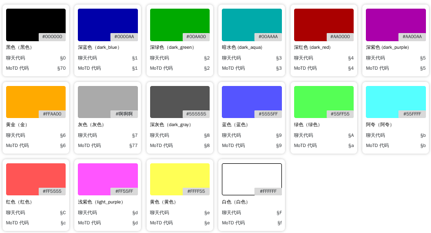

## 前言
你可以使用一些符号使颜色文字更改，它有点不同于原版，它不是像基岩版玩家那像使用<code>§</code>符号进行更改。
## 如何使用
### 常规
在游戏中，你可以使用<code>&</code>而不是<code>§</code>对颜色进行更改  
它的格式是<code>& + 颜色代码 + 文字</code>，比如说，让"你好"变为蓝色  
那么就是<code>&b你好</code>  

图片来自[这里](https://dnschecker.cloud/cn/minecraft-color-codes.html)
### HEX颜色
::: info 提示
以下颜色要求版本1.16+(Java版)  
基岩版无法显示
:::
你可以让文字是任何颜色，么没什么难的  
[这里](https://try8.cn/tool/color/picker)是一个在线的调色器，随便找的，非AD  
格式是<code>&#ffffff</code>其中<code>#ffffff</code>是HEX颜色码，示例是白色
